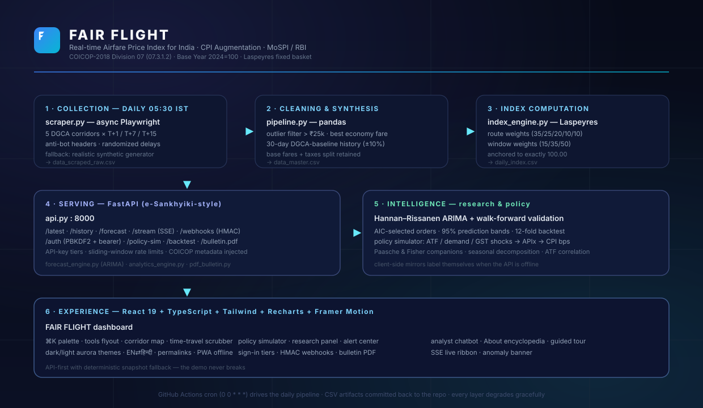
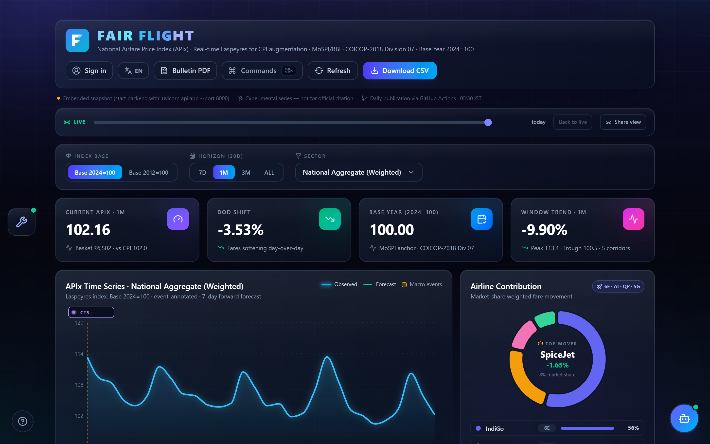
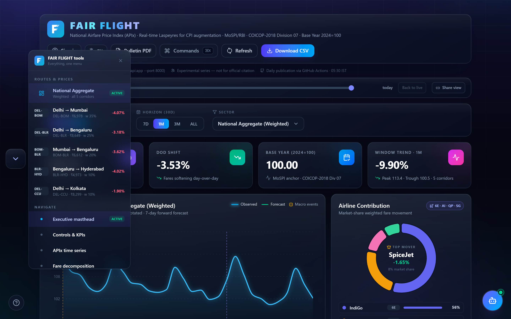
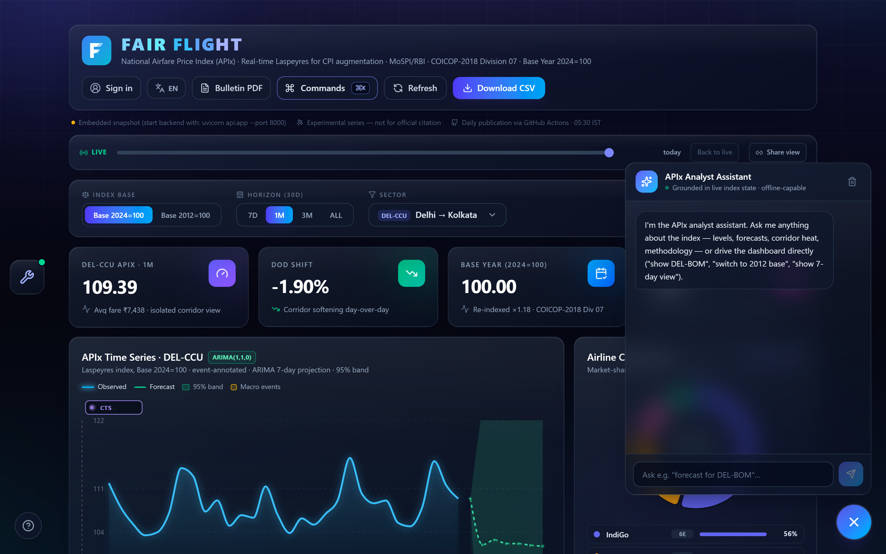
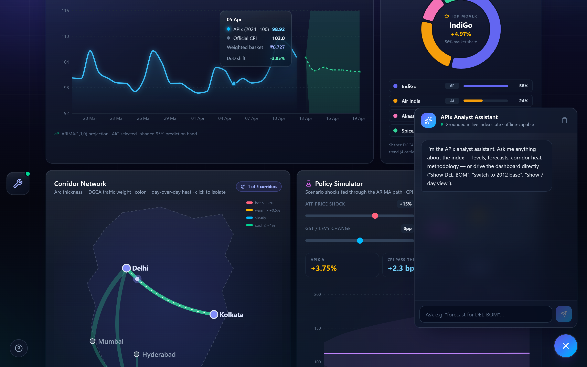
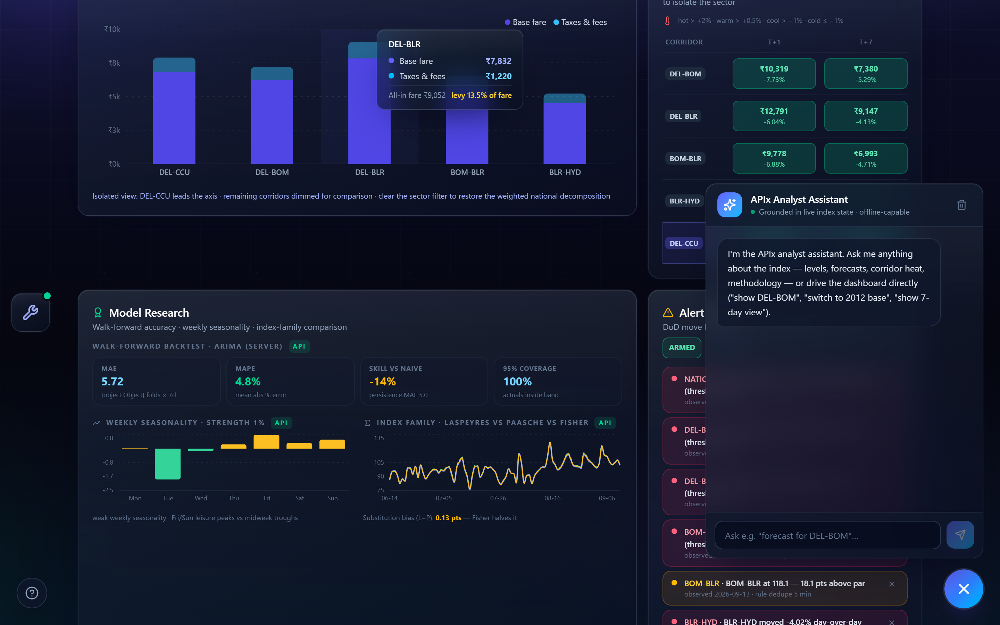
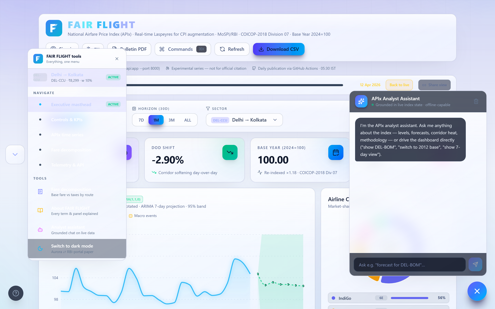

# ✈️ FAIR FLIGHT — Real-time Airfare Price Index for India (APIx)



**FAIR FLIGHT** (Formal Airfare Index for Reporting — *fares, measured fairly*) is a production-grade proof-of-concept that gives India's **MoSPI / RBI** a *daily, web-scraped airfare index* — the exact class of dynamic-services data the **CPI Base Year 2024=100 revision** mandates, mapped to **COICOP-2018 Division 07 (07.3.1.2 — Passenger transport by air)**.

Instead of waiting a month for printed indices, FAIR FLIGHT computes a **weighted Laspeyres APIx** across five DGCA trunk corridors every day, forecasts it with a real **ARIMA** model, simulates **policy shocks** (ATF / demand / GST) down to headline-CPI basis points, and publishes an institutional **PDF bulletin** — behind a fully animated dashboard.

| | |
|---|---|
| **Live index** | Laspeyres fixed basket · route weights 35/25/20/10/10 · booking-window weights 15/35/50 · anchored 2024=100 |
| **Coverage** | DEL–BOM, DEL–BLR, BOM–BLR, BLR–HYD, DEL–CCU at T+1 / T+7 / T+15 |
| **Stack** | FastAPI + pandas/NumPy + Playwright · React 19 + TypeScript + Tailwind + Recharts + Framer Motion |
| **Ops** | GitHub Actions daily pipeline · SSE live push · HMAC webhooks · PWA offline · Docker Compose |

---

## 📸 The dashboard

| | |
|:---:|:---:|
| **Hero — live Laspeyres index with ARIMA band** | **Single-button tools flyout — routes, prices, navigation** |
|  |  |
| **⌘K command palette — 22+ commands, fuzzy search** | **Corridor network map — click any arc to isolate** |
|  |  |
| **Policy simulator — ATF +25% shock, live CPI pass-through** | **Model research — walk-forward backtest & index family** |
|  |  |
| **Light mode — "RBI portal paper" institutional theme** | **About panel — every term & formula explained in-app** |
|  |  |

---

## ⚡ One-command start

```bash
# Option A — everything in Docker
docker compose up --build
#   frontend → http://localhost:5173   ·   backend → http://localhost:8000/docs

# Option B — local dev
cd backend  && pip install -r requirements.txt  &&  python -m uvicorn api:app --port 8000
cd frontend && npm install && npm run dev
```

No backend? The dashboard detects it and runs from the committed snapshot — **the demo never breaks.**

---

## 🏗️ What's inside

### Backend (`backend/`)
| Module | Role |
|---|---|
| `scraper.py` | Async Playwright collector with anti-bot headers; falls back to a realistic synthetic generator so the pipeline always produces data |
| `pipeline.py` | Outlier filter (> ₹25k), best-economy-fare selection, 30-day DGCA-baseline history synthesis |
| `index_engine.py` | Laspeyres aggregation over route × window weights; anchors **exactly 100.00** |
| `forecast_engine.py` | Hannan–Rissanen ARIMA with AIC order selection and 95% prediction bands |
| `analytics_engine.py` | Walk-forward backtests (12 folds, skill vs naive), seasonal decomposition, policy simulation, ATF correlation, Paasche/Fisher companions |
| `pdf_bulletin.py` + `logo_mark.py` | Dependency-free vector PDF bulletin with the AeroTrend brand mark |
| `api.py` | e-Sankhyiki-style REST + SSE stream + HMAC webhooks + PBKDF2 auth with institutional tiering |

### Frontend (`frontend/src/`)
- **⌘K command palette** — 22+ commands (sector, base year, horizon, theme, tour, About…), fuzzy search, keyboard navigation
- **Single-button tools rail** — one docked button opens everything: live route watchlist, section jumps, assistant, theme
- **Corridor map** — animated India SVG arcs, thickness = DGCA weight, colour = day-over-day heat
- **Time-travel scrubber** — recompute the whole dashboard "as of" any past date; permalink every state via URL hash
- **Policy simulator** — shock sliders → ARIMA projection → **CPI basis-point pass-through** at air travel's 0.61% COICOP weight
- **Research panel** — backtest scoreboard, weekday seasonality, Laspeyres vs Paasche vs Fisher
- **Alert center** — SSE-fed threshold rules with browser push notifications
- **Analyst assistant** — chatbot grounded in the live index data
- **About encyclopedia** — 60+ searchable entries explaining every acronym, formula, panel and pipeline stage *inside the product*
- **Guided tour · light/dark aurora themes · EN⇄हिन्दी · PWA offline · shareable permalinks**

---

## 🔌 API (e-Sankhyiki conventions)

```http
GET  /api/v1/apix/latest                      # today's index + COICOP metadata
GET  /api/v1/apix/history?days=30&Format=JSON # trailing series
GET  /api/v1/apix/forecast?scope=NATIONAL&horizon=7
GET  /api/v1/apix/stream                      # SSE live ticks
POST /api/v1/webhooks/register                # HMAC-signed event pushes
POST /api/v1/auth/login                       # institutional tier (gov.in / nic.in)
GET  /api/v1/apix/bulletin.pdf                # print-ready A4 bulletin
```

Demo credentials: `analyst@mospi.gov.in` / `fairflight-demo` (600 req/min institutional tier).

---

## 🚀 Deploy

See **[DEPLOY.md](DEPLOY.md)** — a Render Blueprint (`render.yaml`) ships in-repo: *New → Blueprint → pick the repo → done.* Docker/Fly instructions and the env-var table are included.

Regenerate README screenshots any time with `python scripts/capture_screenshots.py` (needs the dev server up).

---

## 📐 Methodology (short form)

```
APIx_t = 100 × Σᵢ Σw ( RouteWeightᵢ × WindowWeightw × Pᵢ,w,t )
              / Σᵢ Σw ( RouteWeightᵢ × WindowWeightw × Pᵢ,w,0 )
```

Fixed Laspeyres basket → pure price signal. Base anchored to 100.00 per the MoSPI 2024 mandate. Companion Paasche/Fisher indices expose substitution bias (the L−P gap). Forecast = ARIMA(p,1,q) chosen by AIC, validated walk-forward with 95% band coverage. Full explanations live in the in-app **About** panel.

> ⚠️ **Experimental proof-of-concept.** Series are scraper/synthetic-hybrid and *not* for official citation.
